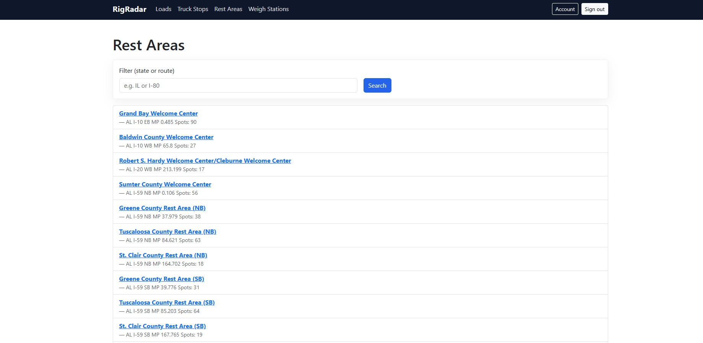

# RigRadar

*Find safe, convenient truck stops and rest areas along your load's
route. Plan, save, and roll.*


------------------------------------------------------------------------

## Table of Contents

-   [Description](#description)
-   [Features](#features)
-   [Screenshots](#screenshots)
-   [Documentation](#documentation)
-   [Installation](#installation)
-   [Usage](#usage)
-   [Contributing](#contributing)
-   [License](#license)
-   [Contact](#contact)
-   [Additional Notes](#additional-notes)

------------------------------------------------------------------------

## Description

RigRadar helps long-haul drivers **pre-plan routes** by discovering
**Truck Stops**, **Rest Areas**, and **Weigh Stations** within a
configurable buffer around the pickup→drop-off corridor.

The application:
- Builds a dynamic "route" between origin and destination.
- Filters stops by provider and parking capacity (number of truck spots).
- Lets drivers **apply custom filters** to quickly find preferred truck stops.
- Shows the **nearest truck stops or rest areas** and the **distance** from both pickup and drop-off points.
- Allows drivers to **click a selected stop or rest area on the map** to view details and highlight the location.
- Lets drivers **open the route in Google Maps** for real-time navigation.
- Provides the **precise address and phone number and direction** for each selected truck stop (when available).
- Driver can access **street view on google map**
- For **rest areas** and **weigh stations**, phone numbers may not be available,
  but the driver can still access **location details** and map information.
- **Automatically includes weigh stations** along the route.

Built with **Ruby on Rails 8**, **Devise** for authentication,
**Pundit** for authorization, **Bootstrap** for responsive UI,
and **Leaflet** for interactive mapping.

------------------------------------------------------------------------

## Features

-   **Load Management (CRUD)** -- create and track loads with
    pickup/drop-off.
-   **Route Corridor Filtering** -- set a mile buffer to find relevant
    stops.
-   **Save Selected Stops** -- choose truck stops/rest areas and attach
    to a load.
-   **Authorization** -- fine-grained access control with Pundit.
-   **Responsive UI** -- Bootstrap 5 for desktop and mobile.
-   **Interactive Maps** -- Leaflet for displaying routes and stops.


------------------------------------------------------------------------
## Screenshots
**Landing page**

**Dashboard**

**pre-planned**

**edit pre-plan**

**updated pre-plan**

**create load**

**edit load**

**Truck stop db**

**Rest area db**

**Weight stations db**

**Truck stop info**

**street view**


## Documentation
- [Functional Requirements Document](./docs/FRD.md)


## Installation

### Prerequisites

-   Ruby 3.x
-   Bundler
-   Postgres (production)

### Steps

1.  **Clone the repository**

    ``` bash
    git clone https://github.com/melhelow/RigRadar.git
    cd RigRadar
    ```

2.  **Install gems**

    ``` bash
    bundle install
    ```

3.  **Set up the database**

    ``` bash
    bin/rails db:create db:migrate db:seed
    ```

4.  **Start the server**

    ``` bash
    bin/dev      # or: rails server
    ```

5.  **Open the app**\
    Visit <http://localhost:3000> in your browser.

------------------------------------------------------------------------

## Usage

1.  **Sign up / Sign in** using Devise.
2.  **Create a Load** by entering pickup and drop-off locations.
3.  **Pre-plan the Route**: filter stops and choose those to save.
4.  **View Saved Stops**: open the load's map to see the stops pinned.

------------------------------------------------------------------------

## Contributing

Contributions are welcome!

1.  **Fork** the repository.

2.  **Create a branch**

    ``` bash
    git checkout -b feature/your-feature
    ```

3.  **Commit** your changes

    ``` bash
    git commit -m "Add some feature"
    ```

4.  **Push** to your branch

    ``` bash
    git push origin feature/your-feature
    ```

5.  **Open a Pull Request** and describe your changes.

------------------------------------------------------------------------

## License

Distributed under the MIT License. See the [`LICENSE`](LICENSE.txt) file
for details.

------------------------------------------------------------------------

## Contact

**Mohamed Elhelw**\
Email: <melhelw558@gmail.com>\
Project Link: <https://github.com/melhelow/RigRadar>

------------------------------------------------------------------------

## Additional Notes

-   **ERD**: The entity-relationship diagram is generated automatically
    

-   **Testing**:

    ``` bash
    RAILS_ENV=test bin/rails db:create db:schema:load
    bundle exec rspec
    ```

-   **CI/CD**: GitHub Actions run RuboCop and Rails tests on each pull
    request.
